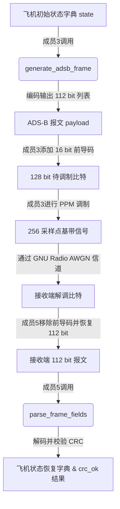

# ADS-B 1090ES 报文结构设计说明

本项目角色：ADS-B / Mode-S 理论调研、报文结构设计、字段编码负责人（成员2）

---

## 1. 设计目标和上下游接口

### 1.1 设计目标
本设计旨在基于 Mode-S 1090ES 协议标准，为课程设计仿真系统实现底层的“协议与报文层”。主要设计目标包括：
1.  **标准化封装：** 严格遵循 Mode-S 112 bit 的物理帧长度与外层结构（DF, CA, ICAO 地址, CRC-24 校验）。
2.  **合理化简化：** 对 56 bit ME（Message, Extended Squitter）字段进行拼装简化，将多维度飞机物理状态（高度、速度、航向、经纬度）容纳至单一报文帧中。
3.  **高可靠检错：** 实现真实的 Mode-S CRC-24 校验多项式计算与异或校验，提供稳健的信道误码拦截屏障。
4.  **无缝对接：** 编写规范的 Python 接口，使其能够被上游发送端调制模块（成员3）与下游接收端解调解析模块（成员5）无缝导入并调用。

### 1.2 上下游接口关系
本模块在完整基带原型系统中的接口调用链关系如下图：



*   **发送端接口 (供成员3调用)：**
    *   导入：`from adsb_frame import generate_adsb_frame`
    *   调用方法：`frame_bits = generate_adsb_frame(state)`
    *   输入：包含物理状态参数的 Python 字典 `state`（包含 `icao`, `altitude`, `speed`, `heading`, `latitude`, `longitude` 等）。
    *   输出：一个长度严格为 112 的整型列表（如 `[1, 0, 1, 0, ...]`），只包含二进制 0 和 1。
*   **接收端接口 (供成员5调用)：**
    *   导入：`from adsb_frame import parse_frame_fields`
    *   调用方法：`result = parse_frame_fields(frame_bits)`
    *   输入：经基带接收解调并剥离前导码后恢复的 112 bit 列表。
    *   输出：一个包含状态恢复量以及 CRC 验证标志位（`crc_ok`）的字典 `result`。

---

## 2. 完整 112 bit 字段结构表

本设计中的 112 bit 报文基于 Mode-S DF=17 格式进行分配，完整结构划分如下：

| 字段 | 位宽 (bits) | bit位置 (0-indexed) | 描述 | 实验设计值/规则 |
| :---: | :---: | :---: | :--- | :--- |
| **DF** | 5 | 0 – 4 | Downlink Format (下行格式) | 固定为 17 (`10001`)，表示 Extended Squitter。 |
| **CA** | 3 | 5 – 7 | Capability (应答机能力) | 固定为 5 (`101`)，表示实验用应答机最大能力。 |
| **ICAO** | 24 | 8 – 31 | ICAO Aircraft Address | 航空器唯一 24 位物理地址，例如 `0xABCDEF`。 |
| **ME** | 56 | 32 – 87 | Message, Extended Squitter | 承载飞机状态的扩展数据段。详见第 3 节。 |
| **CRC** | 24 | 88 – 111 | Parity Check (CRC-24 校验位) | Mode-S 24 位循环冗余校验码。 |

---

## 3. 56 bit ME 字段结构表

为了在一帧报文中容纳飞机的经纬度、高度、速度及航向，本课设的 56 bit ME 字段结构定义如下：

| 子字段 | 位宽 (bits) | ME内部位置 | 完整比特位置 | 描述与物理量对应关系 |
| :--- | :---: | :---: | :---: | :--- |
| **Type Code** | 5 | 0 – 4 | 32 – 36 | 报文子类型码，固定为 19 (`10011`)，标识实验状态消息。 |
| **Altitude** | 12 | 5 – 16 | 37 – 48 | 高度字段，量化步长 25 ft，最大支持高度 102375 ft。 |
| **Speed** | 10 | 17 – 26 | 49 – 58 | 速度字段，单位节 (knot)，直接整数编码。 |
| **Heading** | 9 | 27 – 35 | 59 – 67 | 航向角字段，范围 $[0.0^\circ, 360.0^\circ)$。 |
| **Latitude_Q** | 10 | 36 – 45 | 68 – 77 | 纬度均匀量化字段，物理区间 $[-90.0^\circ, 90.0^\circ]$。 |
| **Longitude_Q** | 10 | 46 – 55 | 78 – 87 | 经度均匀量化字段，物理区间 $[-180.0^\circ, 180.0^\circ]$ |

---

## 4. 每个字段的范围、单位和量化公式

为了保证信号的高密度传输，所有连续的物理浮点数在发送前必须量化并编码为二进制。反之，接收端需要进行反量化以恢复物理量。

### 4.1 高度 (Altitude)
*   **物理范围：** $[0, 102375]\ \text{ft}$
*   **量化步长：** $25\ \text{ft}$
*   **编码量化公式：**
    $$\text{Altitude\_Q} = \text{round}\left(\frac{\text{Altitude}}{25}\right)$$
    其中 $\text{Altitude\_Q} \in [0, 4095]$，占用 12 位。
*   **反量化恢复公式：**
    $$\text{Altitude}_{\text{decoded}} = \text{Altitude\_Q} \times 25$$

### 4.2 速度 (Speed)
*   **物理范围：** $[0, 1023]\ \text{knot}$
*   **量化步长：** $1\ \text{knot}$
*   **编码量化公式：**
    $$\text{Speed\_Q} = \text{round}(\text{Speed})$$
    其中 $\text{Speed\_Q} \in [0, 1023]$，占用 10 位。
*   **反量化恢复公式：**
    $$\text{Speed}_{\text{decoded}} = \text{Speed\_Q}$$

### 4.3 航向 (Heading)
*   **物理范围：** $[0.0^\circ, 360.0^\circ)$
*   **量化步长：** $360.0^\circ / 512.0 = 0.703125^\circ$
*   **编码量化公式：**
    $$\text{Heading\_Q} = \text{round}\left(\frac{\text{Heading}}{360.0} \times 512\right) \bmod 512$$
    其中 $\text{Heading\_Q} \in [0, 511]$，占用 9 位。
*   **反量化恢复公式：**
    $$\text{Heading}_{\text{decoded}} = \frac{\text{Heading\_Q}}{512.0} \times 360.0$$
    航向为环形物理量，接近 $360^\circ$ 的值会回绕至 $0^\circ$ 附近，误差应使用最短角距离计算。

### 4.4 纬度 (Latitude\_Q)
*   **物理范围：** $[-90.0^\circ, 90.0^\circ]$
*   **量化步长：** $180.0^\circ / 1023.0 \approx 0.1760^\circ$
*   **编码量化公式：**
    $$\text{Latitude\_Q} = \text{round}\left(\frac{\text{Latitude} + 90.0}{180.0} \times 1023\right)$$
    其中 $\text{Latitude\_Q} \in [0, 1023]$，占用 10 位。
*   **反量化恢复公式：**
    $$\text{Latitude}_{\text{decoded}} = \frac{\text{Latitude\_Q}}{1023.0} \times 180.0 - 90.0$$

### 4.5 经度 (Longitude\_Q)
*   **物理范围：** $[-180.0^\circ, 180.0^\circ]$
*   **量化步长：** $360.0^\circ / 1023.0 \approx 0.3519^\circ$
*   **编码量化公式：**
    $$\text{Longitude\_Q} = \text{round}\left(\frac{\text{Longitude} + 180.0}{360.0} \times 1023\right)$$
    其中 $\text{Longitude\_Q} \in [0, 1023]$，占用 10 位。
*   **反量化恢复公式：**
    $$\text{Longitude}_{\text{decoded}} = \frac{\text{Longitude\_Q}}{1023.0} \times 360.0 - 180.0$$

---

## 5. CRC-24 生成与验证过程

### 5.1 生成多项式参数
Mode-S CRC 校验使用 24 位多项式，系数表示为十六进制形式为 `0xFFF409`。其完整的除数多项式二进制形式长为 25 位：
$$G(x) = x^{24} + x^{23} + x^{22} + x^{21} + x^{20} + x^{19} + x^{18} + x^{17} + x^{16} + x^{10} + x^3 + 1$$

### 5.2 校验位计算步骤
1.  **构造除数：** 提取报文前 88 位的 payload（即 $\text{DF} + \text{CA} + \text{ICAO} + \text{ME}$）。
2.  **左移对齐：** 将这 88 位整数左移 24 位，相当于在末尾补 24 个 0，构成 112 位的临时数据段 `work`。
3.  **循环除法（模2除法）：**
    *   从 `work` 数据的最高有效比特（第 111 位）向下循环扫描到第 24 位。
    *   如果当前扫描指针位置上的比特值为 1，则使用生成多项式 `MODE_S_POLY` 左移对应位数后，与 `work` 进行按位异或运算。
    *   循环结束后，`work` 寄存器的最低 24 位（第 0 至 23 位）即为模2除法的余数。
4.  **附加余数：** 将该 24 位余数格式化为 bit 列表，作为 CRC 校验字段拼装到 88 位 payload 的尾部，形成 112 位的完整数据帧。

### 5.3 校验验证步骤
接收端收到 112 位的报文比特流后：
1.  提取前 88 位作为数据段，重新执行上述 CRC-24 余数计算，得到 `crc_calculated`。
2.  提取最后 24 位作为接收到的校验字段 `crc_received`。
3.  比对 `crc_calculated` 与 `crc_received` 是否完全一致。若一致，则设置 `crc_ok = True`，认为报文无误码；否则判定发生误码，`crc_ok = False`。

---

## 6. 标准测试状态和生成报文

为了确保测试的可复现性，我们定义了以下标准的飞机测试状态（`TEST_STATE`）：
```python
TEST_STATE = {
    "df": 17,
    "ca": 5,
    "icao": 0xABCDEF,
    "type_code": 19,
    "altitude": 30000,
    "speed": 450,
    "heading": 90.0,
    "latitude": 39.9042,
    "longitude": 116.4074,
}
```

按照该状态进行量化编码与 CRC-24 附加后，最终生成的标准 112 位二进制比特序列如下（已保存在 `data/adsb_frame_bits.txt` 文件中）：
```
1000110110101011110011011110111110011010010110000011100001001000000010111000101101001010101000011100111101101010
```

---

## 7. 解析结果与量化误差

对上述生成的比特流重新进行解析后，恢复的物理量输出及其与原始输入物理量的对比误差分析如下表：

| 参数 | 原始输入值 | 量化后数值 (10进制) | 物理反量化恢复值 | 绝对误差 | 量化步长 | 误差范围判定 |
| :--- | :---: | :---: | :---: | :---: | :---: | :---: |
| **DF** | 17 | 17 | 17 | 0 | - | 完全一致 |
| **CA** | 5 | 5 | 5 | 0 | - | 完全一致 |
| **ICAO** | `0xABCDEF` | `0xABCDEF` | `0xABCDEF` | 0 | - | 完全一致 |
| **Type Code**| 19 | 19 | 19 | 0 | - | 完全一致 |
| **Altitude** | 30000 ft | 1200 | 30000 ft | 0 ft | 25 ft | 0 $\le$ 12.5 ft |
| **Speed** | 450 knot | 450 | 450 knot | 0 knot | 1 knot | 0 $\le$ 0.5 knot |
| **Heading** | $90.0^\circ$ | 128 | $90.0^\circ$ | $0^\circ$ | $0.703125^\circ$ | $\le 0.351563^\circ$ |
| **Latitude** | $39.9042^\circ$ | 738 | $39.85^\circ$ | $0.0542^\circ$ | $\approx 0.1760^\circ$ | $\le 0.0880^\circ$ |
| **Longitude**| $116.4074^\circ$ | 842 | $116.30^\circ$ | $0.1074^\circ$ | $\approx 0.3519^\circ$ | $\le 0.1760^\circ$ |

> [!NOTE]
> 从表中可以看出，由于量化引起的绝对误差，航向、纬度、经度在反量化解码后无法百分之百等同于原始浮点数，但是**绝对误差全部严格小于或等于二分之一量化步长**（理论极限值），完全符合信号量化理论预期。

---

## 8. 测试结果和已知限制

### 8.1 自动测试结果
我们使用 Python 标准库 `unittest` 编写并执行了 11 个自动测试，测试程序为 `code/test_adsb_frame.py`。可使用 `python -m unittest discover -s code -p "test_*.py" -v` 运行：
1.  **T01:** 验证标准状态组帧，输出长度精确为 112。
2.  **T02:** 验证闭环解析，除量化物理量外的控制量（DF, CA, ICAO 等）必须无损恢复。
3.  **T03:** 限制航向和经纬度的反量化误差不得超过半个量化步长，测试均顺利通过。
4.  **T04:** 校验计算无误，正常报文的 `crc_ok` 能够稳定输出 `True`。
5.  **T05:** 在完整报文中注入单比特错码，CRC 拦截检错机制成功判定 `crc_ok = False`。
6.  **T06:** 输入参数越界校验，超限输入（如高度过高，航向过大）成功抛出 `ValueError`。
7.  **T07:** 校验输入报文长度，非 112 位的非法接收数据直接抛出 `ValueError`。
8.  **T08:** 完成文本文件存取往返测试，写入后再读取解析，内容完全吻合。
9.  **T09:** 验证航向接近 $360^\circ$ 时能够正确回绕，不会解码出无效的 $360^\circ$。
10. **T10:** 使用公开的真实 ADS-B 报文验证 Mode-S CRC-24 实现。
11. **T11:** 验证成员3 PPM调制到成员5无噪声解调的接口链路。

### 8.2 已知限制
1.  **单精度限制与量化舍入误差：** 由于位宽限制（10-12 bits），经纬度的地面分辨率相对粗糙，单步长约为十几到几十公里。在实际民航应用中，需要依赖更先进的 CPR 编码或更高的位宽来支撑高分辨率监视。
2.  **多包乱序与时隙未处理：** 该模块为纯协议解析层，不负责处理空域中的报文碰撞或信道干扰带来的多包交叠现象。
